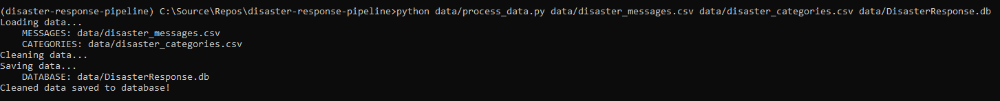
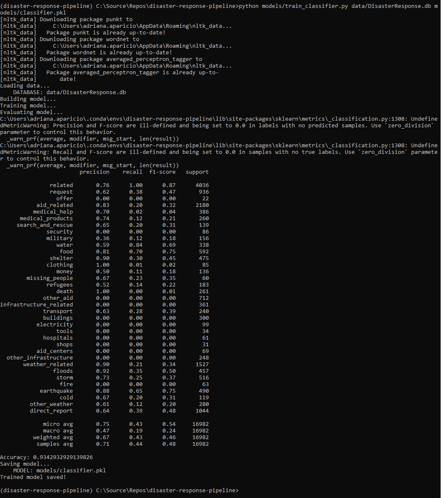
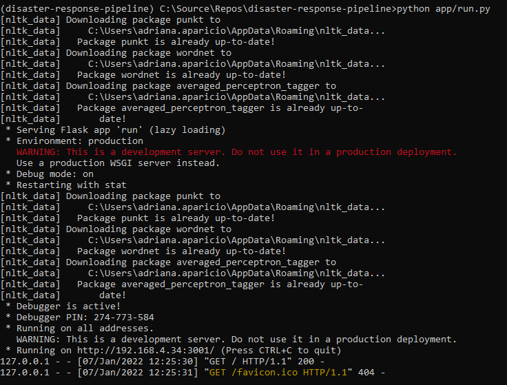
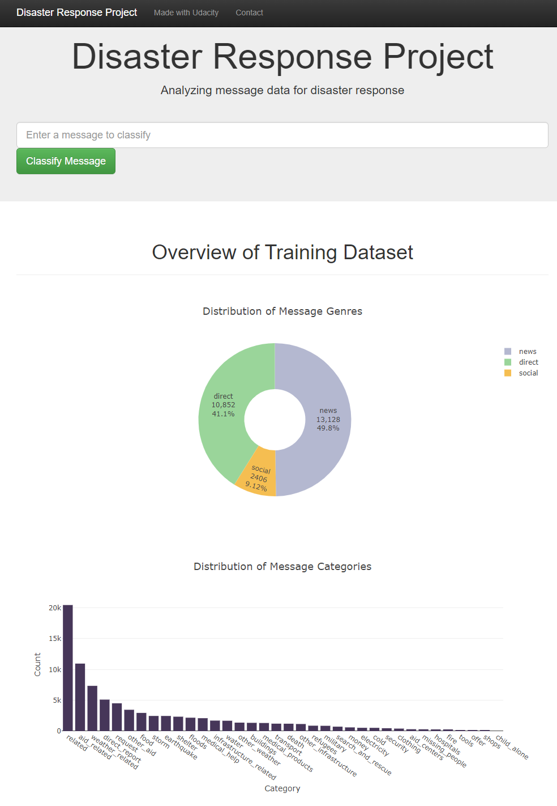
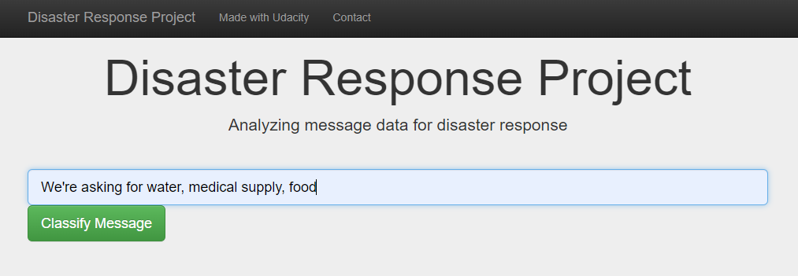
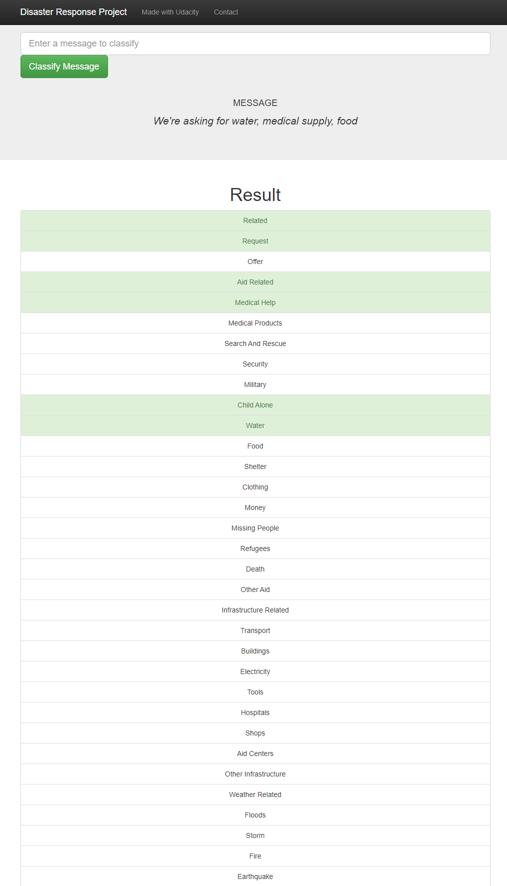

# Disaster Response Pipeline Project

## Table of Contents
1. [Description](#description)
2. [Getting Started](#getting_started)
	1. [Dependencies](#dependencies)
	2. [File Structure](#file_structure)
	3. [Installing](#installation)
    4. [Instructions](#instructions)
	5. [Additional Material](#material)
    6. [It's Alive!](#production)
3. [Known Issues](#known-issues)
4. [Acknowledgement](#acknowledgement)
5. [License](#license)


<a name="description"></a>
## Description
The aim of this project is to provide a web application to categorize messages from real-life disaster events. This is built on top of a Natural Language Processing (NLP) trained model. The dataset, used for training the model, contains pre-labelled tweet and messages from real-life disaster events. 
This project is part of Data Science Nanodegree Program by Udacity in collaboration with Figure Eight.

There are three important parts in the project:
1. Build an ETL pipeline to extract data from provided sources, clean the data and save it in a SQLite database.
2. Build a NLP model using Machine Learning pipelines to train and optimize the categorization of text messages.
3. Expose the model via web app in order to classify messages in real time.

<a name="getting_started"></a>
## Getting Started
<a name="dependencies"></a>
### Dependencies
* Python 3.7+
* SQLite database libraries: SQLalchemy
* Machine Learning libraries: Pandas, Numpy, Scikit-Learn
* Natural Language Processing libraries: NLTK
* Web App and Data Visualization libraries: Flask, Plotly

More detailed information can be found in requirements.txt file.
<a name="file_structure"></a>
### File Structure
This is the file structure of the project:
```
.
├───app
│   └───templates
│   │   └───go.html
│   │   └───master.html
│   └───run.py
├───data
│   └───disaster_categories.csv
│   └───disaster_messages.csv
│   └───DisasterResponse.db
│   └───process_data.py
├───models
│   └───classifier.pkl
│   └───train_classifier.py
└───preparation
│   └───categories.csv
│   └───classifier.pkl
│   └───ETL Pipeline Preparation.ipynb
│   └───messages.csv
│   └───ML Pipeline Preparation.ipynb
└───screenshots
│   └───main_page.PNG
│   └───sample_input.PNG
│   └───sample_output.PNG
└───.flake8
└───README.md
└───requirements.txt
```

The most important files are:
* **app/run.py**: Launch the Flask app used to classify text messages.
* **data/process_data.py**: Responsible of ETL pipeline, extract, clean, transform and store the data in the SQLite database.
* **model/train_classifier.py**: Responsible of Machine Learning pipeline, load the data for training the model and save the model as .pkl file which can be consumed later from the predictions via web app.

<a name="installation"></a>
### Installing
* Clone the repository.
    ```
    git clone https://github.com/adriapa5/disaster-response-pipeline.git
    ```
* Be sure that you have installed the required version of python or event better you have a proper conda enviroment ready with python 3.7+.
* Install the necessary libraries provided in requirements.txt file.
* Follow the instructions provided in the next section.

<a name="instructions"></a>
### Instructions:
1. Run the following commands in the project's root directory to set up your database and model.

    - To run ETL pipeline that cleans data and stores in database
        ```
        python data/process_data.py data/disaster_messages.csv data/disaster_categories.csv data/DisasterResponse.db
        ```
        
    - To run ML pipeline that trains classifier and saves
        ```
        python models/train_classifier.py data/DisasterResponse.db models/classifier.pkl
        ```
        

2. Run the following command to run your web app.
   ```
   python app/run.py
   ```
   
3. Go to http://localhost:3001/

<a name="material"></a>
### Additional Material

There are a couple of jupyter notebooks in **preparation** folder that can be useful to understand how the model is built step by step:
1. **ETL Preparation Notebook**: related to the implementation of the ETL pipeline
2. **ML Pipeline Preparation Notebook**: related to the implementation of the Machine Learning Pipeline

The **ML Pipeline Preparation Notebook** can be used to re-train or tune the model.

<a name="production"></a>
### It's Alive!

This application has been deployed and you can play with it [here](https://disaster-response-pipeline-zkxgj.ondigitalocean.app/).

1. The main page shows some graphs about training dataset, provided by Figure Eight



2. This is an example of a message that can be introduced to test the performance of the model



3. After clicking **Classify Message**, the message will be categorized and the belonging message categories will be highlighted in green



<a name="known_issues"></a>
## Known Issues
The provided dataset is imbalanced. There are categories with many examples (like aid_related for example) and they are called **Majority Classes**. On the other hand, there are categories that have few examples (eg: some categories like water, transport or fire have few representation) and they are called **Minority Class**. 
This can causes several issues, because the minority classes are harder to predict due to the small representation. Also, the abundance of examples from the majority classes can swamp the minority class.
As you can see on the provided screenshot for Machile Learning Pipeline Output in the [Instructions](#instructions) section, the overall **accuracy** of the model seems to be pretty good (0.93). However, if you take a look deeper on the metrics (precision and recall mainly) for minority classes, you will see that they do not look pretty good. First, some refresh about the meaning of these **metrics**:

* **accuracy**: the ratio of correctly predicted observation to the total observations
* **precision**: the ratio of correctly predicted positive observations to the total predicted positive observations. High precision relates to the low false positive rate.
* **recall**: the ratio of correctly predicted positive observations to the all observations in actual class.

We will take a look on the metrics for some of the minority classes:
|category|precision|recall|
|water|0.59|0.84|
|transport|0.63|0.28|
|fire|0.00|0.00|

All the metrics for **fire** category are 0.00 which this means that the model won't be able to predict correctly that category. 
For **transport** category, the precision is not bad, but the recall is very low. This means that the majority of the predicted labels for transport category will be correct when compared to the training labels, but the model will return very few results for this category. 
For **water** category, the recall is high but the precision isn't which means that the model returns many results and most of its predicted labels are incorrect when are compared to the training labels.

Summarizing, a naive application of a model may focus on learning the characteristics of the abundant observations only, neglecting the examples from the minority class that is, in fact, of more interest and whose predictions are more valuable. An ideal system will have high precision and high recall and it will return many results, with all results labeled correctly.

You can find more information about imbalanced dataset in the following links:
* [What is imbalanced classification](https://machinelearningmastery.com/what-is-imbalanced-classification/)
* [Accuracy, Precision, Recall & F1 Score](https://blog.exsilio.com/all/accuracy-precision-recall-f1-score-interpretation-of-performance-measures/)
* [Precision-Recall metric](https://scikit-learn.org/stable/auto_examples/model_selection/plot_precision_recall.html)

<a name="acknowledgements"></a>
## Acknowledgements
* [Udacity](https://www.udacity.com/) for proposing this project as part of the Data Science Nanodegree Program.
* [Figure Eight](https://www.figure-eight.com/) for providing the data to train the model.
<a name="license"></a>
## License
[](https://opensource.org/licenses/MIT)
